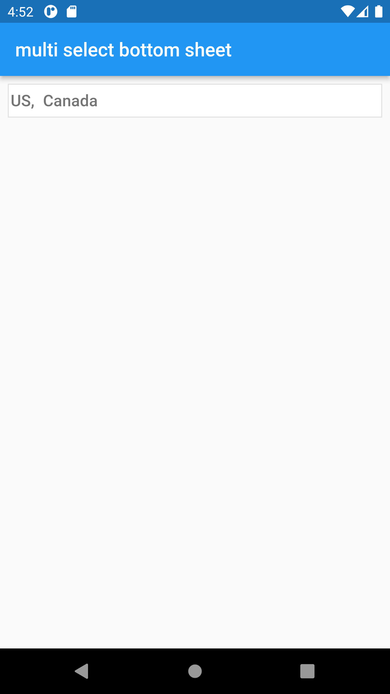
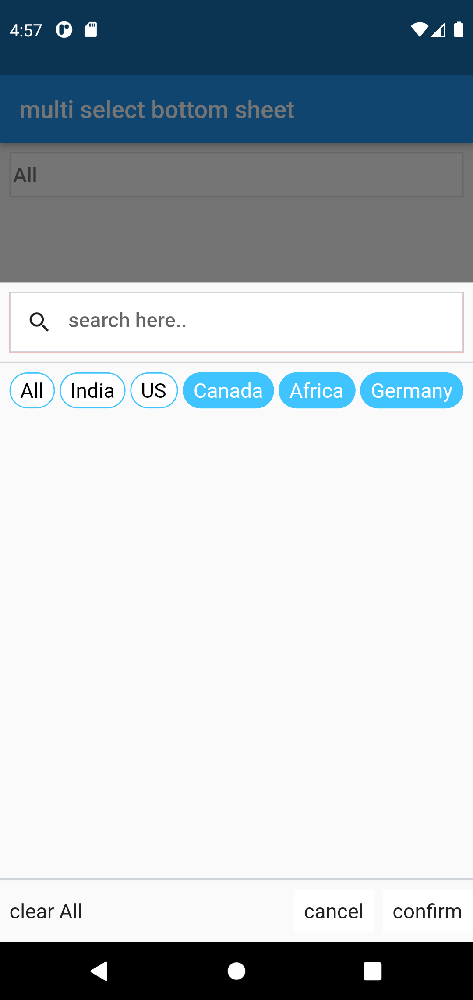

# Multi Select BottomSheet

Simple and easy to use flutter Widget to add a multiSelectBottomSheet to your Flutter Application.This Widget allows you to search and select from list of suggestions.

## Usage example

|  |  |

```dart
List<MultiSelectBottomSheetModel> selectCountryItem = [
    MultiSelectBottomSheetModel(id: 0, name: "All", isSelected: true),
    MultiSelectBottomSheetModel(id: 1, name: "India", isSelected: false),
    MultiSelectBottomSheetModel(id: 2, name: "US", isSelected: false),
    MultiSelectBottomSheetModel(id: 3, name: "Canada", isSelected: false),
    MultiSelectBottomSheetModel(id: 4, name: "Africa", isSelected: false),
    MultiSelectBottomSheetModel(id: 5, name: "Germany", isSelected: false),
  ];
TextEditingController controller = TextEditingController();

MultiSelectBottomSheet(
              items:selectCountryItem ,// required for Item list.
              width: width*0.96,
              bottomSheetHeight: height*0.7,// required for min/max height of bottomSheet.
              hint: "select country",
              controller: controller,
              searchTextFieldWidth:width*0.96,
              searchIcon:const Icon(   // required for searchIcon.
                 Icons.search,
                 color:Colors.black87,
                 size: 22
             ),
             selectTextStyle: const TextStyle(
                 color: Colors.white,
                 fontSize: 17
             ),
             unSelectTextStyle:const TextStyle(
                 color: Colors.black,
                 fontSize: 17
             ),
          ),
```

## Constructors

### MultiSelectBottomSheet

| Parameter | Type | Description |
|---|---|---
| `items` | List<MultiSelectBottomSheetModel> | The source list of options. |
| `searchIcon` | Icon | The icon button that shows the search field. |
| `bottomSheetHeight` | double | Set the bottomSheet Height. |
| `hint` | String | Style the text of the display hint. |
| `width` | double | Set the display text field width. |
| `searchTextFieldWidth` | double | Give the search text field width. |
| `searchHint` | String | Set the placeholder text of the search field. |
| `unSelectTextStyle` | TextStyle | Specifies the style of text on unselected list tiles. |
| `selectTextStyle` | TextStyle | Specifies the style of text on selected list tiles. |
| `searchHintTextStyle` | TextStyle | Style the text of the search hint. |
| `suggestionListBorderColor` | Color | Set the border color of the chip items that are selected and unselected. |
| `unSelectedBackgroundColor` | Color | Set the color of the chip items that are unselected. |
| `selectedBackgroundColor` | Color | Set the color of the chip items that are selected. |
| `borderColor` | Color | Set the border color of the display items of text field. |
| `textColor` | Color | Set the text color of display items. |
| `hintColor` | Color | Set the hint text color of display items. |
| `clearAll` | String | Specifies the clearAll button text and remove selected items. |
| `confirmText` | String | Specifies the confirm button text. |
| `cancelText` | String | Specifies the cancel button text. |


